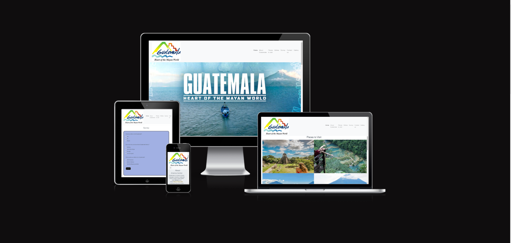
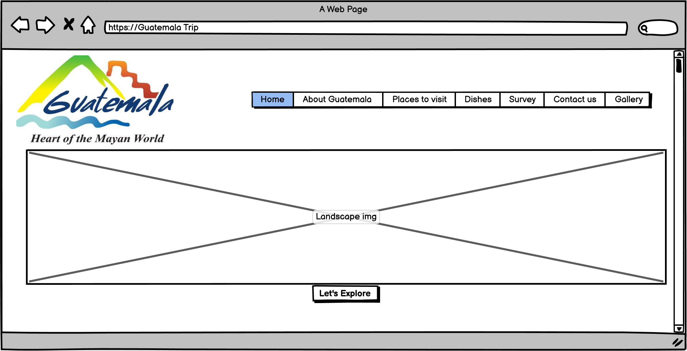

# Guatemala's Trips

This is an official website where you can find a valid, time-real news and updates about the souces how to discover more. Contact agencies to find out more. 
reliable and funcionality to inform you about your next trip to Guatemala country, Maya World heart.

[View live project here] https://pamelss.github.io/guatemalaTrip/index.html

<h1 align="center">Milestones Project 1</h1>

-   ### User stories

    -   #### First Time Visitor Goals

        1. As a Traveller I want to see an oficial Website about Guatemala Country, not only Social Media that can disturb the information and could be not valid.
        2. As a Mother I want to be able to have a valid Website information compressed in one single website.
        3. Being a Traveller and a offical turism website can help with enquiries and not message strangers via Social Media and looking my selft stranger asking for information.

    -   #### Returning Visitor Goals

        1. As for Travellers asking for information about an specifict country.
        2. For families have trust the website and learn in ine single website and have the posibility to contact for more information.
        3. Show to the Travellers some offical gallery with no filters or missing information online.

-   ### Design
    -   #### Colour Scheme
        -   Colors are used to potential the information rather than design, colours used Light Grey, and White.
    -   #### Typography
        - Sans serif, used on the whole website.
    -   #### Imagery
        -   An landscape image as to adversite the visitor what is about when they first open the website.

*   ### Wireframes
    + Desktop Version:

        * Home Page:
         

        * Landscape Page:
        

        * Contact Us Page:
        

        * Gallery Page:
        

    + Mobile Version:
        * Home Page:
        

        * Contact Us Page:
        

        * Gallery Page:
        

<!-- 
    

 -->

## Features

-   Responsive on all device sizes

## Technologies Used

### Languages Used

-   [HTML5](https://en.wikipedia.org/wiki/HTML5)
-   [CSS3](https://en.wikipedia.org/wiki/Cascading_Style_Sheets)

### Frameworks, Libraries & Programs Used

1. [Bootstrap 4.4.1:](https://getbootstrap.com/docs/4.4/getting-started/introduction/)
    - Bootstrap was used to assist with the responsiveness and styling of the website.
1. [jQuery:](https://jquery.com/)
    - jQuery came with Bootstrap to make the navbar responsive but was also used for the smooth scroll function in JavaScript.
1. [Git](https://git-scm.com/)
    - Git was used for version control by utilizing the Gitpod terminal to commit to Git and Push to GitHub.
1. [GitHub:](https://github.com/)
    - GitHub is used to store the projects code after being pushed from Git.

1. [Balsamiq:](https://balsamiq.com/)
    - Balsamiq was used to create the [wireframes](https://github.com/) during the design process.

### Accesibility

Lighthouse Devtool from Google Chrome used for testing.

+ Descktop Version:
    - Home Page:
    

    - Contact Us Page:
    

    - Gallery Page:
    

+ Mobile Version:

    - Home Page:
      

    - Mobile Contact Page:
    

    - Mobile Gallery Page:
    

## Testing

The W3C Markup Validator and W3C CSS Validator Services were used to validate every page of the project to ensure there were no syntax errors in the project.

 ## HTML W3C Validator

- [W3C Markup Validator](https://validator.w3.org/)
    - [Home page Results](<assets/img/WireFrames/W3Cvalidator.png>)
    - [Contact Us page Results](<assets/img/WireFrames/W3CvalidatorContact.png>)
    - [Gallery page Results](<assets/img/WireFrames/W3CvalidatorGallery.png>)

 ## CSS W3C Validator
-   [W3C CSS Validator Results](<assets/img/WireFrames/W3C_CSS_VALIDATOR.png>)

### Known Bugs

-  On mobile Version the spand burger menu is over the main img landscape
-  Dishes img are not lined up.
-  Anchor tags are not jumping straight to the specific title of the section.
- The landing homepage is not vissible when deploying in GoitHub.
    - Landing Homepage:

    

### Acknowledgements

-   My Mentor for continuous helpful feedback.

-   Tutor support at Code Institute for their support.
